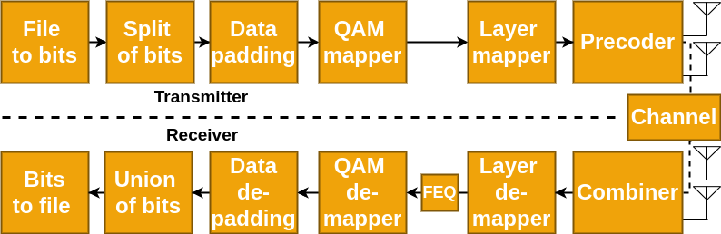

# C MIMO - Implementation of MIMO Digital Communication System

**Table of Contents**

- [C MIMO - Implementation of MIMO Digital Communication System](#c-mimo---implementation-of-mimo-digital-communication-system)
    - [Project Description](#project-description)
    - [Requisites](#requisites)
    - [How to Use](#how-to-use)
        - [Custom Mode](#custom-mode)
        - [Pre-setting Mode](#pre-setting-mode)
        - [Results Analysis](#results-analysis)
    - [Makefile Guide](#makefile-guide)
        - [Variables](#variables)
        - [Rules](#rules)


# Project Description
This project was developed for the Engineering Project II course taught in the second semester at the Faculty of Computing and Telecommunications of the Federal University of Pará. The objective of this project is to develop a Multiple Input Multiple Output (MIMO) Digital Communication System in C language. The system to be implemented is described in the image below:

<div align="center">
    
</div>

Since its initial development, this project has been enhanced with new features and evaluation metrics, further expanding its capabilities and usefulness to now serve as an educational tool for others to learn just as we did during the project's development. The enhancements have been designed to provide a practical understanding of high-capacity wireless communications, particularly relevant with the advent of fifth-generation (5G) mobile networks. The project, developed in alignment with the [Conceive, Design, Implement, and Operate (CDIO)](http://www.cdio.org/) initiative, aims to help students grasp the fundamentals of modern communication systems and signal processing. By offering comprehensive documentation and free access, it aims to contribute to the educational resources available to the telecommunications community.

A detailed description of these enhancements and the overall project can be found in our [website's documentation](https://lasseufpa.github.io/C_MIMO/). 

## Requisites

- GSL Library (`gsl/gsl_linalg.h`): The GNU Scientific Library (GSL) is a numerical library for C and C++. In this case, the linear algebra part is being used.

- Makefile: a utility that automates the process of building programs, managing dependencies between source files.

To install the dependencies above run `install_dependencies.sh` with the following command in the terminal:

```bash
sh install_dependencies.sh
```

## How to Use

To compile the project, run the following command in the terminal:

```bash
make
```

To run the project, run the following command in the terminal:

```bash
make test
```

To clean the project (remove the object directory and all test files), run the following command in the terminal:

```bash
make clean
```

The system offers two modes of operation, upon execution, the user is prompted to choose between these two modes. The choice is made through a simple console interface where the user inputs either 1 for the pre-setting mode or 2 for the custom mode.

### Pre-setting Mode
In Pre-setting Mode, the system operates with predefined parameters. This mode is designed for users who prefer to run the system with standard configurations without customization.

- **Receive Antennas ($N_r$):** Varies in the set $\{2^1, 2^2, \ldots, 2^7\}$
- **Transmit Antennas ($N_t$):** Each $N_t$ is double the corresponding $N_r$, varying in the set $\{2^2, 2^3, \ldots, 2^8\}$

### Custom Mode
In Custom Mode, the user specifies the parameters. The system collects specific inputs from the user using the `getUserInput` function.

- **Parameters to be specified by the user:**
  - Number of Receive Antennas ($N_r$)
  - Number of Transmit Antennas ($N_t$)
  - Noise Level (r)

### Results Analysis

When running a simulation, an `output.csv` file is generated containing statistics from the tests, such as the test number, number of receiving antennas ($N_r$), number of transmitting antennas ($N_t$), SER (Symbol Error Rate), BER (Bit Error Rate), SNR (Signal-Noise Ratio), EVM (Error Vector Magnitude), and channel capacity.

Such a csv file can be easily viewed and interpreted by a Python script in a Jupyter Notebook called `analyzer.ipynb` that can be accessed through [Google Colab](). This Notebook also contains the calculations and formulas for the mentioned metrics.

# Makefile Guide

This Makefile is used to compile and clean a C project that includes the `pds_telecom.c` file and a matrix library. Here's a step-by-step guide on how to use this Makefile.


## Variables

- `src`: The directory where the project's source code is located.
- `matrix`: The directory where the source code for the matrix library is located.
- `obj`: The directory where the object files and the executable will be placed.
- `out`: The name of the executable.
- `w`: Warning flags for the gcc compiler.
- `gsl`: Flags to link the GSL library.
- `math`: Flag to link the math library.
- `font`: The path to the `pds_telecom.c` file.
- `test_arq`: A pattern that matches the test files.

## Rules

- `all`: This is the default rule. It creates the object directory (if needed) and compiles the executable.
- `$(obj)/$(out)`: This rule compiles the executable. It depends on the object file of the matrix library and the `pds_telecom.c` file.
- `$(obj)/matrix.o`: This rule compiles the object file of the matrix library. It depends on the source code file of the matrix library.
- `$(obj)`: This rule creates the object directory, if it doesn't already exist.
- `test`: This rule runs the executable.
- `clean`: This rule removes the object directory and all test files.


